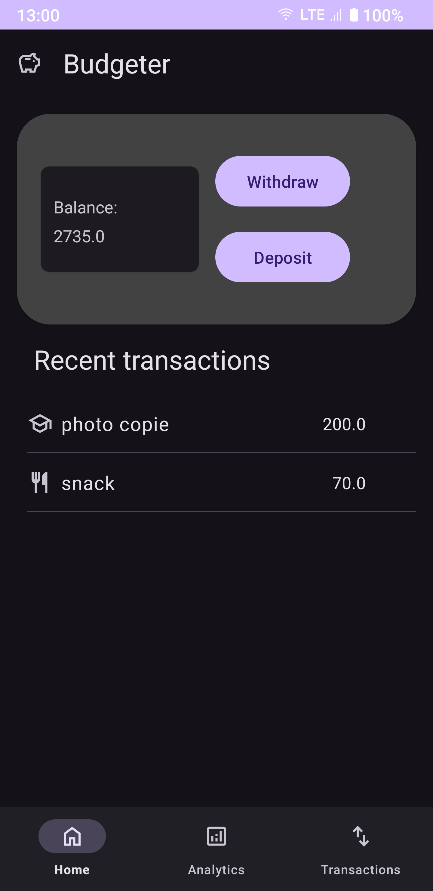

#  Budgeter 

Budgeter is a simple budgeting app, this is still in very early stages.

## Screenshots
<table>
  <tr>
    <td></td>
    <td></td>
    <td></td>
    <td></td>
    <td></td>
  </tr>
   <tr>
    <td></td>
    <td></td>
    <td></td>
    <td></td>
    <td></td>  
  </tr>
</table>

## Screenshots (legacy)

<table>
  <tr>
    <td></td>
    <td></td>
    <td></td>
    <td></td>
    <td></td>
    <td></td>
  </tr>
   <tr>
    
  </tr>
</table>

## Features

Features include:

* Record Adding and withdrawing of funds.
* Categories to organize your spending.
* Balance tracking after each transaction.
* A pie chart of spending by category.
* A line chart of balance changes over time.
* A history of all transactions recorded.
* Fully offline.
* Dark theme support.
* Dual language, Eng/Fr.

## Download
Get the app from our [releases page](https://github.com/naitgacem/Budgeter/releases).

## Issues, Feature Requests and Contributing

Any feedback is welcome and much needed!

## License

    Copyright 2023 AIT GACEM Nabil

    Licensed under the Apache License, Version 2.0 (the "License");
    you may not use this file except in compliance with the License.
    You may obtain a copy of the License at

    http://www.apache.org/licenses/LICENSE-2.0

    Unless required by applicable law or agreed to in writing, software
    distributed under the License is distributed on an "AS IS" BASIS,
    WITHOUT WARRANTIES OR CONDITIONS OF ANY KIND, either express or implied.
    See the License for the specific language governing permissions and
    limitations under the License.
